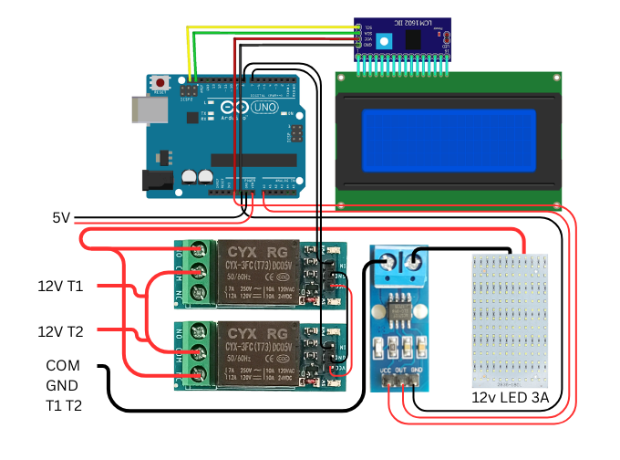

# Automatic Load Balancer using Arduino

**A smart Arduino-based system to demonstrate load balancing between two transformers using relays and a current sensor.**

---

## Table of Contents

- [Introduction](#introduction)  
- [Features](#features)  
- [Hardware Required](#hardware-required)  
- [Folder Structure](#folder-structure)  
- [Circuit Diagram](#circuit-diagram)  
- [Working Principle](#working-principle)  
- [Installation / Usage](#installation--usage)  
- [Code Explanation](#code-explanation)  
- [Calibration](#calibration)  
- [Demo Mode](#demo-mode)  
- [Notes](#notes)  
- [Future Improvements](#future-improvements)  
- [License](#license)  

---

## Introduction

This project demonstrates an **automatic load balancing system** using:

- **Arduino**
- **Two relay modules**
- **Current sensor (ACS712)**
- **20x4 LCD display**

The system automatically switches **Transformer 2** ON when the load increases and OFF when load drops, while displaying **real-time current and transformer status**. It is safe and ideal for educational demonstrations.

---

## Features

- Automatic load-based switching between two transformers  
- Hysteresis logic to prevent T2 oscillation  
- Safe startup: all relays OFF initially  
- Calibration routine for current sensor  
- Real-time current and transformer status on 20x4 LCD  
- Demo sequence to show T1 and T2 separately  

---

## Hardware Required

| Component | Quantity | Notes |
|-----------|---------|------|
| Arduino Uno | 1 | Any standard Arduino |
| Relay Module (5V) | 2 | For switching transformers or demo loads |
| ACS712 Current Sensor | 1 | Measures load current |
| 20x4 I2C LCD | 1 | Displays transformer states and current |
| Jumper Wires | As needed | Connect components |
| Breadboard / PCB | Optional | For prototype setup |

---

## Circuit Diagram
